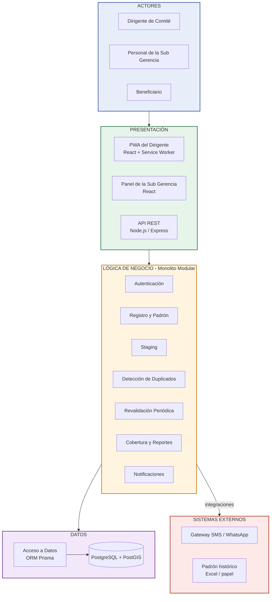
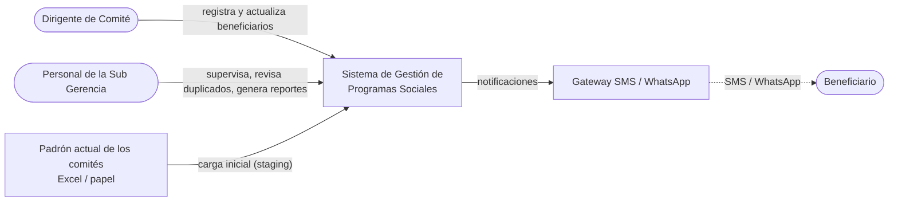

# Arquitectura inicial del sistema

## Diagrama de arquitectura

## Descripción

La arquitectura inicial se organiza en tres capas principales sobre un monolito modular:

- **Presentación:** permite la interacción de los usuarios con el sistema mediante la PWA del dirigente, el panel de la Sub Gerencia y la API REST.
- **Lógica de negocio:** contiene los módulos responsables de las funcionalidades: autenticación, registro y padrón, staging, detección de duplicados, revalidación, cobertura y reportes, y notificaciones.
- **Datos:** almacena y consulta la información mediante un ORM y una base de datos PostgreSQL con PostGIS.

Además, la capa de negocio se integra con sistemas externos: el módulo de **Notificaciones** con el **gateway SMS/WhatsApp** y el módulo de **Staging** con el **padrón histórico** de cada comité.

## Asignación de requisitos a módulos

| Módulo (capa de negocio) | Requisitos | Responsabilidad |
|--------------------------|------------|-----------------|
| Autenticación | RF-12, RF-13, RNF-04 | Valida credenciales de dirigentes y personal municipal (JWT) y controla accesos por rol. |
| Registro y Padrón | RF-01, RF-03, RF-05, RF-14 | Registra y actualiza beneficiarios por comité; mantiene el historial de cambios. |
| Detección de Duplicados | RF-02, RF-04 | Verifica si el DNI ya existe en otro comité y alerta a la Sub Gerencia. |
| Revalidación Periódica | RF-06 | Programa y controla la revalidación de cada beneficiario cada 6 meses. |
| Notificaciones | RF-07 | Genera y encola las notificaciones hacia el gateway SMS/WhatsApp. |
| Cobertura y Reportes | RF-08, RF-09, RF-10 | Calcula beneficiarios activos por zona, genera reportes y exporta el padrón. |
| Staging | RF-11 | Limpia y estructura la carga inicial de Excel/CSV antes de consolidarla. |

## Reglas de dependencia

- Cada capa solo se comunica con la capa inmediata inferior (Presentación → Negocio → Datos).
- Los módulos de negocio comparten el mismo proceso y la misma capa de acceso a datos, pero no deben acceder directamente a las tablas de otro módulo; se comunican mediante sus interfaces.
- Los sistemas externos se integran desde la capa de negocio, no desde la presentación ni desde la base de datos.

## Justificaciones de diseño

- **Staging separado del Registro y Padrón (DA07):** los datos históricos de Excel y papel llegan con errores y duplicados. Si se cargaran directo, contaminarían el padrón real. El staging permite validarlos y limpiarlos antes de consolidarlos.
- **Base de datos aislada (DA03):** contiene datos personales sensibles. Solo el servidor de aplicaciones puede acceder a ella, lo que reduce la superficie de ataque.

## Vista de contexto

Esta vista muestra el sistema como una caja negra: solo aparecen sus actores y los sistemas con los que se comunica. El diagrama de arquitectura, en cambio, muestra su estructura interna por capas y módulos.
